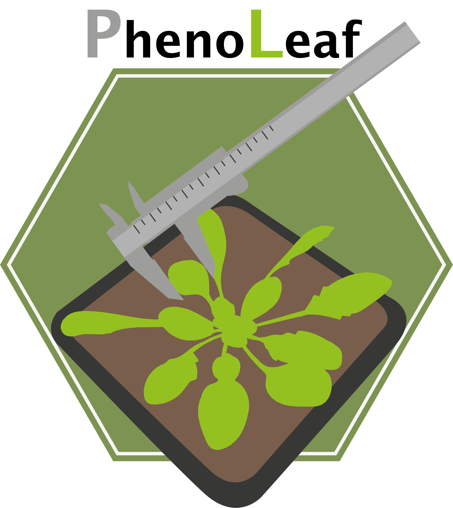

# image_analysis_arabidopsis

# Plant Rosette Segmentation and Radius Measurement

Welcome to the PhenoLeaf Segmentation project! This repository contains Python and Jupyter Notebook as well as Bash scripts to perform image segmentation and automatically measure the radius of a plant's rosette.

## Features

- **environment.yml**: This file contains all the dependencies (and more) required to execute PhenoLeaf.

- **PL_code.py**: This file contains Python code to segment a plant rosette from an image and measure its radius.
- **Demonstration.ipynb**: This file contains Jupyter notebook to present all the functions. 

- **.sh**: These files contains scripts to apply PL function to large datasets.

- **picture_data_base**: This folder contains images you can pick to use/test the code.
  
- **Efficiency_test**: This folder contains data retaled to a test of the algorithm and R code to analyse its performances.
